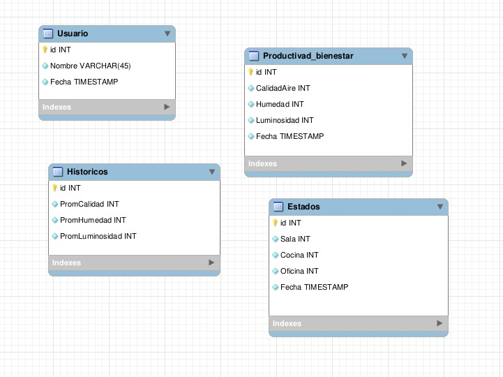
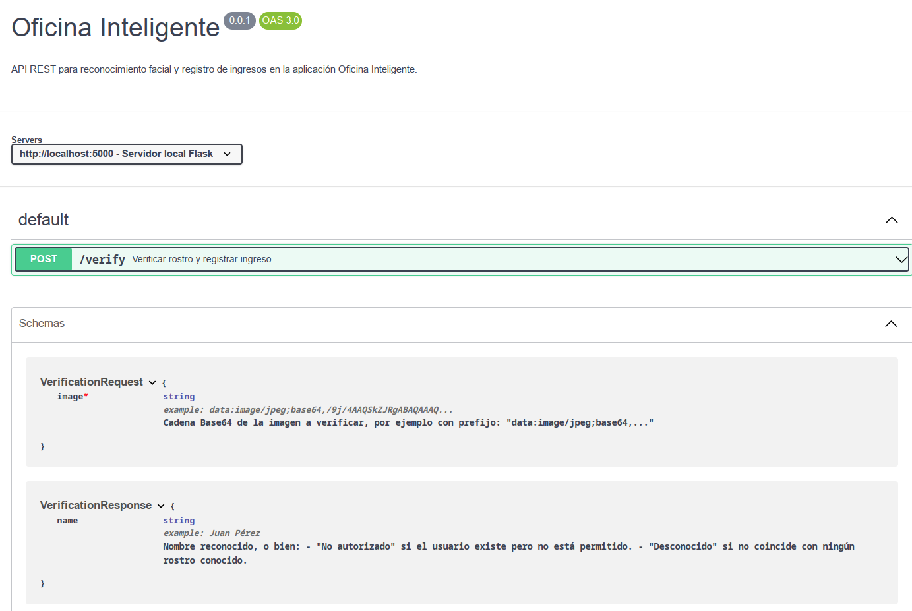

# Universidad de San Carlos de Guatemala

# Facultad de ingenieria

# Escuela de ciencias y sistemas

# Arquitectura de computadores y ensambladores 2

# Proyecto 2

---

## Descripcion de la solucion
### vision general del proyecto
El proyecto consiste en un sistema de automatización inteligente para espacios de oficina, diseñado para mejorar la productividad, eficiencia energética y bienestar laboral mediante tecnologías IoT, Machine Learning y Cloud Computing. El sistema integra sensores, actuadores y un broker MQTT para el control remoto de dispositivos, junto con dashboards interactivos para monitoreo en tiempo real.

### Arquitectura 


## Capas del Framework
# Capas del Framework IoT – Sistema de Automatización Inteligente

## 1. Capa de Hardware
- **Sensores y actuadores:**
  - `Sensor de humedad`: Control del riego en huerto con minibomba de agua.
  - `Sensor de gas (MQ)`: Detección de gases contaminantes en habitaciones.
  - `Botones de ocupación`: Indican presencia en cada cuarto de la maqueta.
  - `Sistema de iluminación`: Controlado por potenciómetro (simulación de dimmer).
  - `Cámara`: Reconocimiento facial para autenticación de usuarios.
- **Dispositivos de control:**
  - `Arduino Mega`: Lectura de sensores, control de actuadores y comunicación con el servidor mediante MQTT.
- **Infraestructura:**
  - Maqueta con **6 cuartos**, **un huerto** y **una talaquera**.
  - Red local configurada para conexión del backend y sensores.

---

## 2. Capa de Software
- **Firmware en Arduino Mega:**
  - Lectura y control en tiempo real de sensores (humedad, gas, ocupación, iluminación).
  - Publicación de datos vía MQTT al backend.
- **Backend (Node.js):**
  - Recepción de datos de sensores a través de MQTT (`Mosquitto`).
  - Procesamiento y almacenamiento en **MySQL alojado en AWS**.
  - Módulo de reconocimiento facial para autenticación mediante cámara.
- **Frontend (Vite):**
  - Visualización de gráficos en tiempo real con **Grafana** incrustado.
  - Mapas interactivos de ocupación de habitaciones.
  - Interfaz de usuario para diagnóstico ambiental y control básico.

---

## 3. Capa de Comunicación
- **Protocolo MQTT:**
  - **Broker:** Mosquitto (en red local o en la nube).
  - **Topics usados:**
    - `sensor/humedad`: Lecturas de humedad del huerto.
    - `sensor/gas`: Detección de gases.
    - `cuartos/ocupacion`: Estado de ocupación por cuarto.
    - `iluminacion/nivel`: Datos del potenciómetro.
    - `reconocimiento/usuario`: Resultado del reconocimiento facial.
  - **QoS:** Nivel 1 para asegurar entrega de datos críticos.
- **Conexión serial/UART:**
  - Arduino se comunica con módulos que envían datos al backend.

---

## 4. Plataforma en la Nube
- **Almacenamiento en AWS:**
  - **Base de datos MySQL en RDS:** Guarda datos históricos por sensores, ocupación y autenticaciones.
- **Broker Mosquitto (opcional en la nube):**
  - Para extender el alcance del sistema y permitir administración remota.
- **Seguridad:**
  - Encriptación `TLS/SSL` para conexiones MQTT seguras.
  - Autenticación mediante reconocimiento facial (sin contraseñas).

---

## 5. Aplicaciones en la Nube
- **Grafana:**
  - Dashboards personalizados para:
    - Niveles de humedad y alertas de riego automático.
    - Presencia por habitación (ocupación en tiempo real).
    - Detección de gases y alertas ambientales.
    - Historial de acceso mediante reconocimiento facial.
  - Integración directa con MySQL y MQTT.
- **API del Backend:**
  - Recibe datos del frontend para interacción y visualización.
  - Sirve gráficos e información contextual de sensores.

## Modelo de Entidad Relacion



## api contracts


```yaml
openapi: 3.0.3
info:
  title: Oficina Inteligente
  version: 0.0.1
  description: >
    API REST para reconocimiento facial y registro de ingresos en la aplicación Oficina Inteligente.

servers:
  - url: http://localhost:5000
    description: Servidor local Flask

paths:
  /verify:
    post:
      summary: Verificar rostro y registrar ingreso
      description: >
        Recibe una imagen en Base64, detecta rostros conocidos y:
        - Si coincide con un usuario autorizado, registra el ingreso y devuelve su nombre.
        - Si coincide pero el usuario no está en la base de datos, devuelve "No autorizado".
        - Si no se detecta un rostro conocido, devuelve "Desconocido".
      requestBody:
        required: true
        content:
          application/json:
            schema:
              $ref: '#/components/schemas/VerificationRequest'
      responses:
        '200':
          description: Resultado del reconocimiento facial
          content:
            application/json:
              schema:
                $ref: '#/components/schemas/VerificationResponse'
        '400':
          description: Solicitud inválida (imagen no proporcionada)
          content:
            application/json:
              schema:
                type: object
                properties:
                  error:
                    type: string
                    example: "No image provided"

components:
  schemas:
    VerificationRequest:
      type: object
      required:
        - image
      properties:
        image:
          type: string
          description: |
            Cadena Base64 de la imagen a verificar, por ejemplo con prefijo:
            "data:image/jpeg;base64,..." 
          example: "data:image/jpeg;base64,/9j/4AAQSkZJRgABAQAAAQ..."

    VerificationResponse:
      type: object
      properties:
        name:
          type: string
          description: >
            Nombre reconocido, o bien:
            - "No autorizado" si el usuario existe pero no está permitido.
            - "Desconocido" si no coincide con ningún rostro conocido.
          example: "Juan Pérez"
```


## Scripts

## Valor Disruptivo
