# Documentación del Proyecto IoT

## Descripción de la Solución
El **Sistema de Monitoreo de Pacientes en un Hospital** es una solución basada en tecnologías de IoT, esta diseñada para mejorar la eficiencia en la atención hospitalaria mediante el monitoreo en tiempo real de los pacientes. El sistema integra sensores médicos, autenticación segura y visualización de datos en un dashboard interactivo, facilitando la toma de decisiones médicas y optimizando la gestión hospitalaria. Los sensores ECG y de oximetría instalados en las camillas recopilan información sobre los signos vitales de los pacientes y la transmiten mediante el protocolo MQTT a un backend desarrollado en Spring Boot, que procesa y almacena los datos en una base de datos relacional como PostgreSQL o MySQL.

Para garantizar la seguridad y control de acceso, se utiliza autenticación mediante tarjetas RFID, permitiendo diferenciar roles entre residentes y especialistas, donde los residentes solo pueden visualizar datos y llenar formularios, mientras que los especialistas pueden realizar diagnósticos y dar de alta a los pacientes. 

La información recopilada se visualiza en un dashboard web, y se complementa con paneles interactivos en Grafana, mostrando métricas en tiempo real como ocupación de camillas, estadísticas de signos vitales y alertas de valores críticos. Además, el sistema permite la generación automática de reportes PDF con el historial médico y las constancias de alta, incluyendo firmas digitales y estadísticas basadas en los datos recopilados. La solución está diseñada para ser escalable, permitiendo la integración de más camillas y sensores en el futuro, asegurando una gestión hospitalaria eficiente, segura y automatizada.

## Capas del Framework IoT

## 1. Capa de Hardware
- **Sensores biomédicos:**
  - ECG (electrocardiograma) para medir actividad cardíaca.
  - Sensor de oximetría para niveles de oxígeno en sangre.
  - Sensores de presencia en camillas (final de carrera, infrarrojos, etc.).
- **Dispositivos de control:**
  - Arduino/ESP32: Lectura de sensores, gestión de RFID y comunicación con el backend.
  - Lectores RFID MFRC522: Autenticación de médicos mediante tarjetas.
- **Infraestructura:**
  - Camillas equipadas con sensores.
  - Hotspot local para acceso al dashboard de Grafana.

## 2. Capa de Software
- **Firmware en Arduino/ESP32:**
  - Lectura de datos de sensores en tiempo real.
  - Comunicación serial/UART con el backend (Spring Boot).
- **Backend (Spring Boot):**
  - Autenticación de médicos via RFID.
  - Procesamiento de datos médicos (ECG, oximetría).
  - Gestión de base de datos relacional (PostgreSQL/MySQL).
  - Integración con MQTT para publicación/suscripción de datos.
- **Frontend Web:**
  - Dashboard interactivo para visualización de pacientes.
  - Formularios clínicos y gestión de diagnósticos.
  - Generación de reportes PDF con firmas digitales.

## 3. Capa de Comunicación
- **Protocolo MQTT:**
  - **Topics principales:**
    - `sensores/datos`: Datos crudos de ECG y oximetría.
    - `diagnostico/realizado`: Notificaciones de diagnósticos completados.
    - `camillas/estado`: Estado de ocupación de camillas.
  - **Configuración:**
    - Broker: HiveMQ.
    - QoS 1 para garantizar entrega de datos críticos.
- **Red Local:**
  - Hotspot para acceso al dashboard de Grafana.
  - Conexión UART entre Arduino y backend.

## 4. Plataforma en la Nube
- **Almacenamiento:**
  - Base de datos relacional en la nube (ej: AWS RDS, Azure SQL).
  - Historial médico con dimensión temporal.
- **Broker MQTT en la nube:**
  - HiveMQ Cloud para gestión escalable de mensajes.
- **Servicios de seguridad:**
  - Encriptación TLS/SSL para datos sensibles (ECG, RFID).
  - Autenticación OAuth2 para médicos.

## 5. Aplicaciones en la Nube
- **Grafana Cloud:**
  - Dashboards en tiempo real:
    - Gráficos de signos vitales por camilla.
    - Porcentaje de ocupación del hospital.
    - Alertas automáticas para valores críticos (ej: ECG anómalo).
  - Integración directa con MQTT y bases de datos.
- **Aplicación Web Responsive:**
  - Acceso multiplataforma (móvil, desktop) vía navegador.
  - Gestión remota de pacientes y diagnósticos.
  - Descarga de certificados de alta médica en PDF.

# Descripción de los Sensores

### Sensor MAX30102

| **Tamaño** | **Tipo de Lectura** | **Instalación** | **Rango de Medición** | **Unidad de Medida** | **Imágenes** | **Precio Estimado** | **Fechas de Importación** |
|------------|---------------------|-----------------|-----------------------|----------------------|--------------|---------------------|---------------------------|
| 14mm x 17mm | Óptico          | Dedo, Muñeca, Tórax | 870nm a 900nm     | HR y SpO₂       |  | Q165.00        | (Especificar)         |

**Enlace para comprar**: [Comprar MAX30102](https://www.electronicadiy.com/products/max30102-sensor-pulso-y-concentracion-oxigeno)

---

### Sensor ECG

| **Tamaño** | **Tipo de Lectura** | **Instalación** | **Rango de Medición** | **Unidad de Medida** | **Imágenes** | **Precio Estimado** | **Fechas de Importación** |
|------------|---------------------|-----------------|-----------------------|----------------------|--------------|---------------------|---------------------------|
| 28mm x 35mm  | Eléctrico       | Tórax, Extremidades |   ±1 mV a ±5 mV     | milivoltios (mV)    |  | $165.00          | (Especificar)         |

**Enlace para comprar**: [Comprar Sensor ECG](https://tienda.tettsa.gt/producto/sensor-de-pulso-cardiaco-ad8232-ecg/)

---

### Sensor de Temperatura y Humedad DHT11

| **Tamaño** | **Tipo de Lectura** | **Instalación** | **Rango de Medición** | **Unidad de Medida** | **Imágenes** | **Precio Estimado** | **Fechas de Importación** |
|------------|---------------------|-----------------|-----------------------|----------------------|--------------|---------------------|---------------------------|
| 19 mm x 17 mm x 19 mm | Digital          | Ambiente    | 0 °C a 50 °C y 20% a 90% HR     | °C y %  |  | Q25.00          | (Especificar)         |

**Enlace para comprar**: [Comprar Sensor de DHT11](https://tienda.tettsa.gt/producto/sensor-de-temperatura-y-humedad-dht11/)

---

### Sensor RFID

| **Tamaño** | **Tipo de Lectura** | **Instalación** | **Rango de Medición** | **Unidad de Medida** | **Imágenes** | **Precio Estimado** | **Fechas de Importación** |
|------------|---------------------|-----------------|-----------------------|----------------------|--------------|---------------------|---------------------------|
| 40mm × 60mm | Electromagnético | Lector RFID     |   0 a 60 mm     | milímetros (mm)    |  | Q50.00          | (Especificar)         |

**Enlace para comprar**: [Comprar Sensor RFID](https://laelectronica.com.gt/modulo-sensor-rfid-rc522)

---

## Mockups del Prototipo
### Boceto del prototipo


### Ubicacion de cada componente


## Fotografías del Prototipo

### RFID
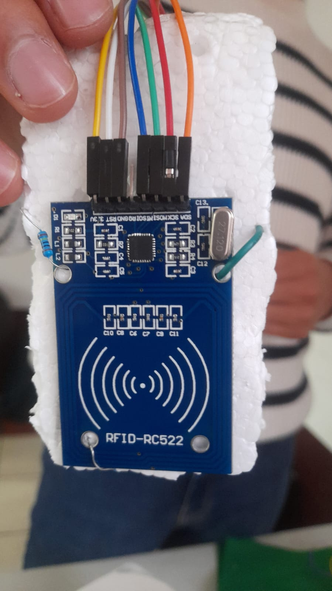

### MQ-135
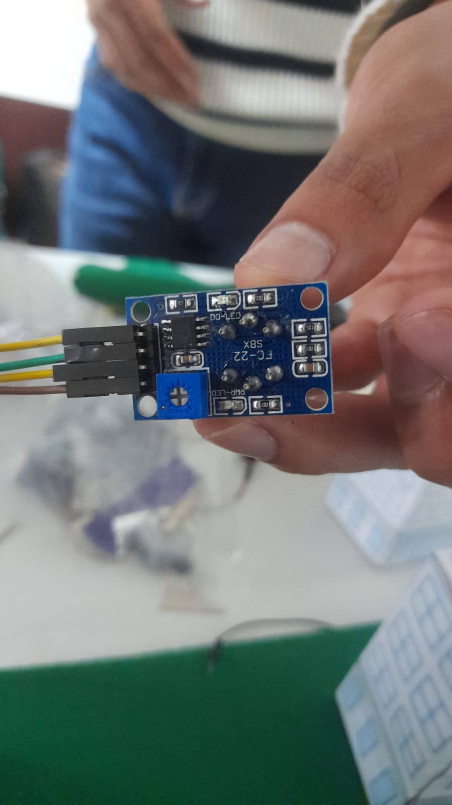

### AD8232
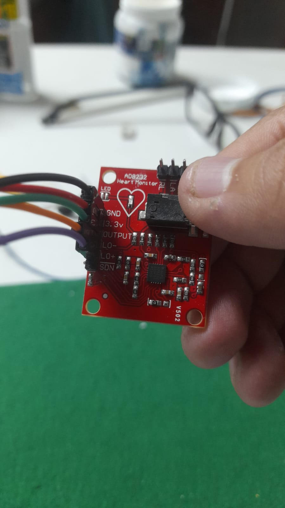

### Desarrollo
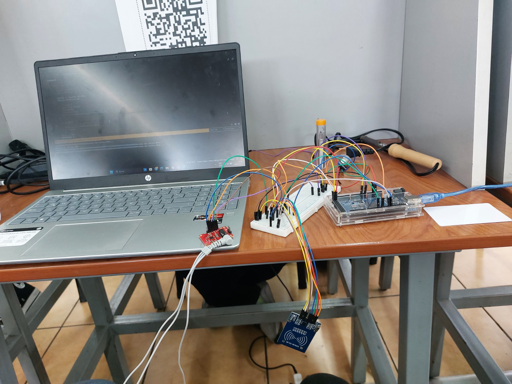
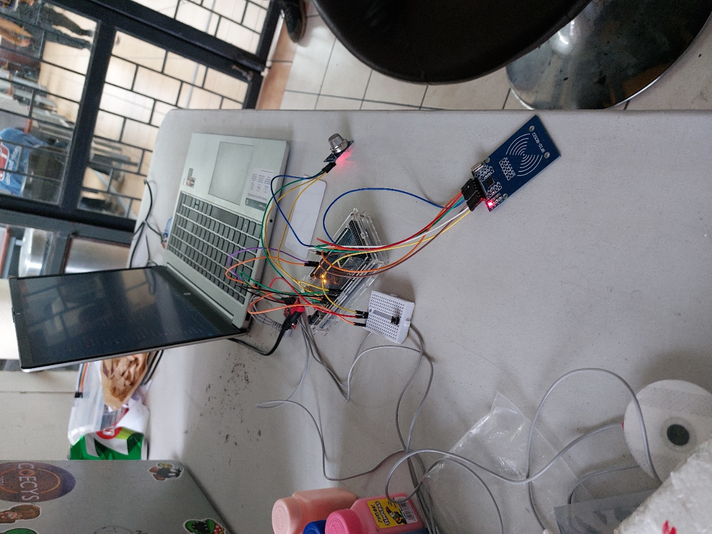
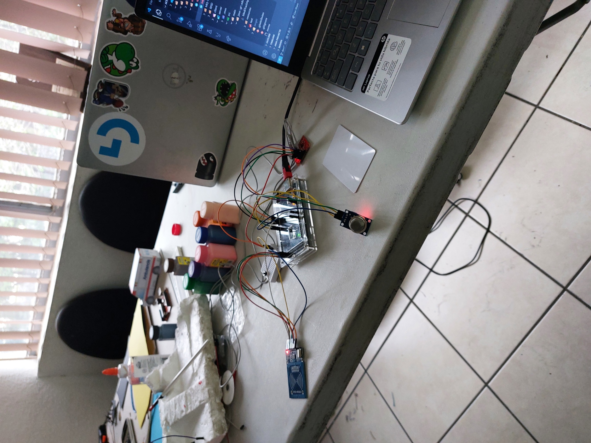
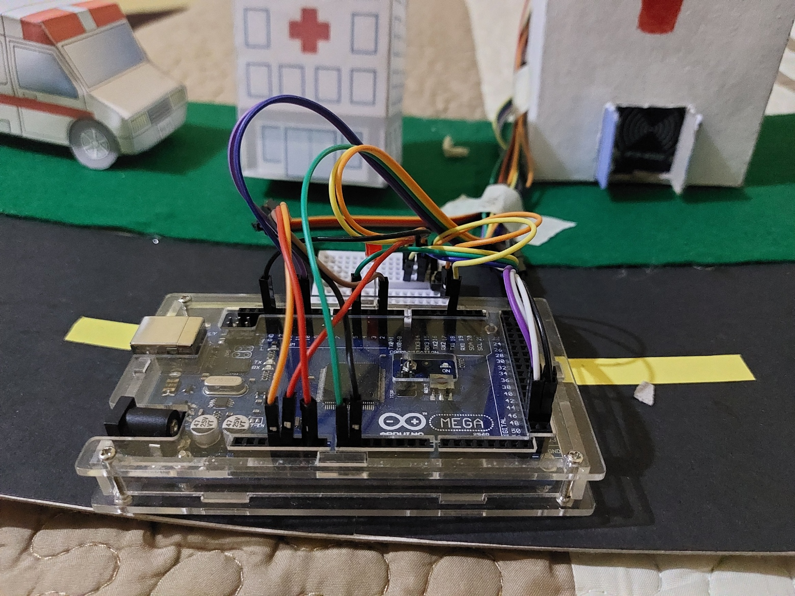
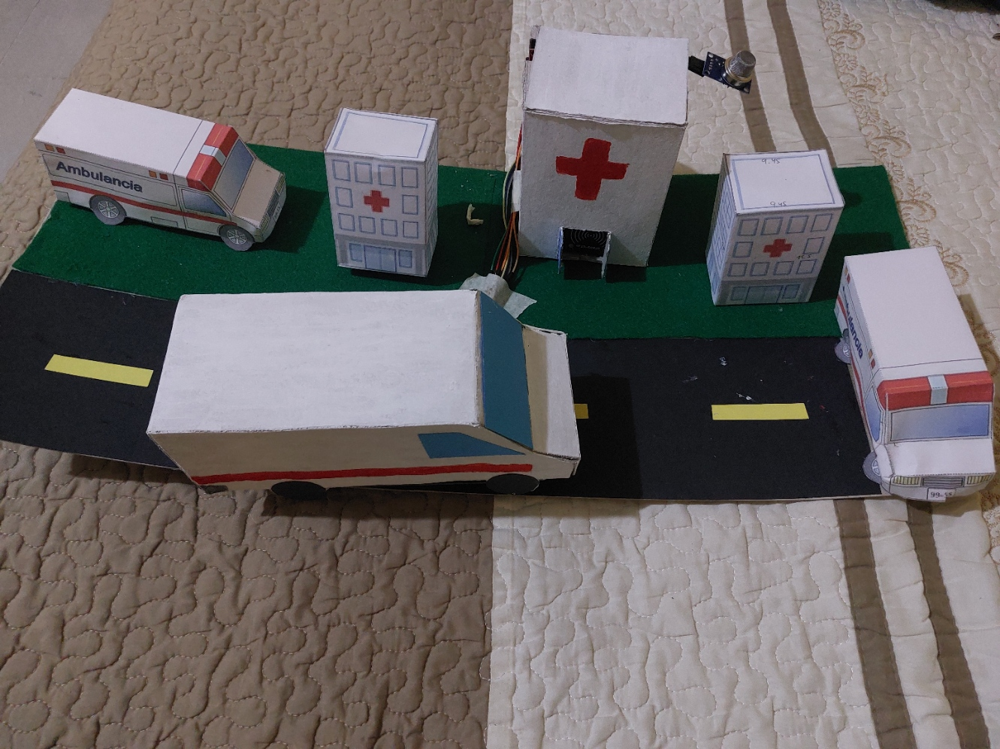

## Mockups de la Aplicación Web/Móvil
### Mockups de la Aplicación Web

#### Login


#### Ventana de Doctores


#### Registro de Pacientes


#### Actualización de Datos del Paciente


#### Ventana para Pacientes


#### Actualización de Datos del Paciente


#### Vista de Historial Médico


## Diagrama de Conexiones
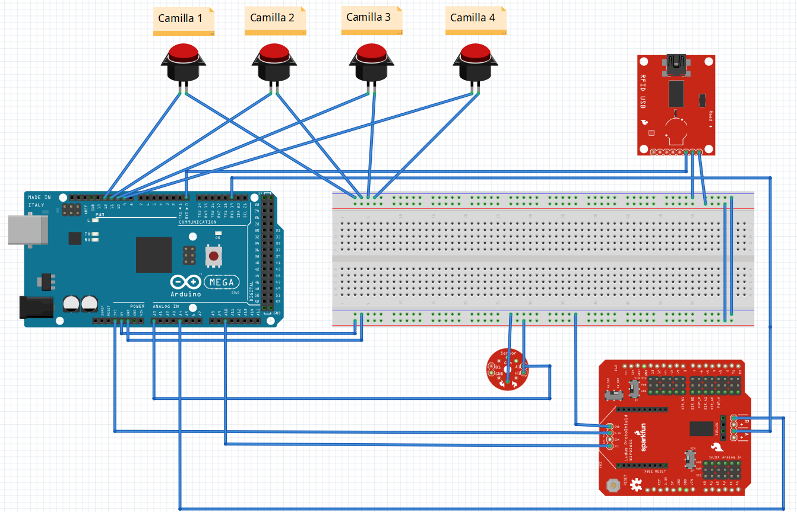

## Diagrama de Arquitectura de Software

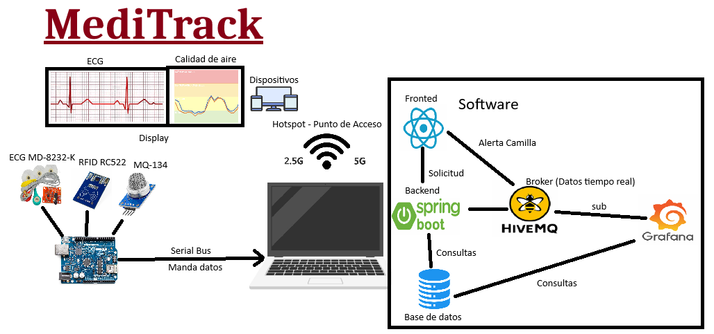

## Diagrama de Bloques y Estructuras del RFID
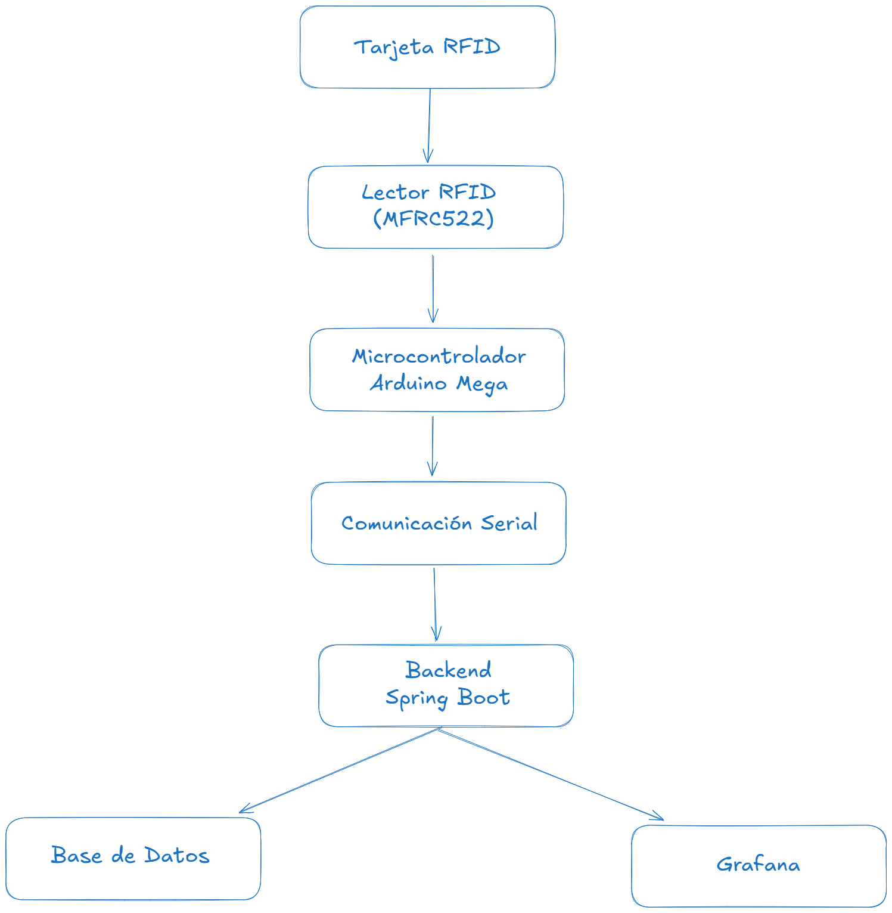


## Diagrama de Flujo de la Solución del Prototipo
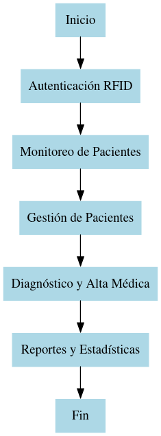

## Modelo Entidad-Relación de la Base de Datos

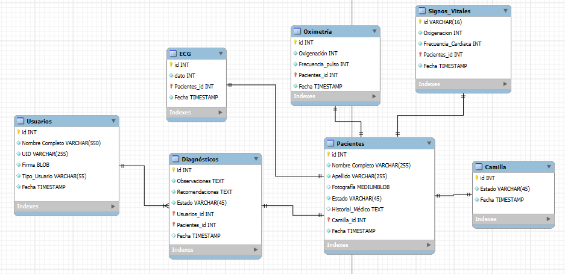

## Listado y Descripción de Consultas SQL
### Verificar Inicio
##### SELECT * FROM usuarios WHERE UID = 'UID_Consultado';

### Declarar Camillas

##### INSERT INTO Camilla (Estado , Fecha) VALUES (Alta_Baja,fecha);

### Llenar Formulario

##### INSERT INTO Pacientes (Nombre Completo,Fotografía, Estado,Historial_Médico, Camilla_id, Fecha) VALUES (Texto, Foto,Alta_Baja,texto,Numero_id,fecha);

##### INSERT INTO Diagnósticos (Pacientes_id, Usuarios_id,Estado,Observaciones,Recomendaciones) VALUES (Numero_id, Numero_id_Usuarios,Alta_Baja,texto,texto,fecha);


### Registros de signos vitales
##### INSERT INTO ecg (Pacientes_id, dato,Fecha) VALUES (Numero_id, Numero_dato,fecha);

##### INSERT INTO Oximetría (Pacientes_id, Oxigenación,Frecuencia_pulso,Fecha) VALUES (Numero_id, Numero_Oxigeno,Numero_Pulso,fecha);

##### INSERT INTO Signos_Vitales (Pacientes_id, Oxigenación,Frecuencia_cardica,Fecha) VALUES (Numero_id, Numero_Oxigeno,Numero_Cardiaca,fecha);

### Datos Pacientes

##### SELECT * FROM Pacientes WHERE id = 'id_consultado';

## Explicación del Broker MQTT

El protocolo **MQTT (Message Queuing Telemetry Transport)** es un estándar ligero de comunicación basado en **publicación/suscripción**, ideal para sistemas IoT como el que estás desarrollando.

En este proyecto, el **broker MQTT** maneja la comunicación entre los dispositivos médicos (Arduino/ESP32) y el servidor/backend, que almacena los datos en la base de datos.


## 🔹 Conceptos Claves de MQTT

### 1. Broker MQTT

El **broker** es el servidor que administra los mensajes enviados por los dispositivos IoT y los distribuye a los suscriptores.

### Funciones del broker:

- Recibe datos de los sensores médicos (RFID, ECG, oximetría).
- Distribuye los datos a los clientes suscriptores (backend, Grafana, frontend web).
- Asegura la entrega de mensajes según diferentes niveles de calidad de servicio (**QoS**).
- Maneja múltiples conexiones IoT de forma eficiente.


### 2. Topics en MQTT

Los **topics** en MQTT son los "canales" donde se publican y reciben los mensajes. En el proyecto, los topics pueden organizarse de la siguiente manera:

| **Topic**               | **Descripción**                                         |
| ----------------------- | ------------------------------------------------------- |
| `sensores/datos`        | Publica los datos en tiempo real de todos los sensores. |
| `sensores/oxigeno`      | Publica los niveles de oxígeno de cada paciente.        |
| `sensores/ecg`          | Publica los datos del electrocardiograma.               |
| `diagnostico/realizado` | Notifica cuando un diagnóstico ha sido registrado.      |

Ejemplo de publicación de datos en un topic:

```python
client.publish("sensores/ecg", "Paciente_1: 78 BPM")
```

### 3. Métodos Principales en MQTT

#### 🔹 Publicar (`publish`)

Un dispositivo envía datos a un topic.

```python
client.publish("sensores/datos", "Paciente_1: ECG OK")
```

#### 🔹 Suscribirse (`subscribe`)

Un dispositivo o sistema recibe datos en tiempo real de un topic.

```python
client.subscribe("sensores/ecg")
```

### 4. Calidad de Servicio (QoS)

El **QoS (Quality of Service)** en MQTT define cómo se entregan los mensajes:

| **Nivel QoS**         | **Descripción**                                          |
| --------------------- | -------------------------------------------------------- |
| **0 (At most once)**  | Mensaje enviado sin confirmación (puede perderse).       |
| **1 (At least once)** | Mensaje garantizado al menos una vez (puede duplicarse). |
| **2 (Exactly once)**  | Mensaje entregado solo una vez (más lento pero seguro).  |

Ejemplo de publicación con QoS 1:

```python
client.publish("sensores/oxigeno", "97%", qos=1)
```


### 5. Utilidades del MQTT en el Proyecto

#### 📌 Beneficios de usar MQTT en el sistema hospitalario:

- **Comunicación en tiempo real** entre sensores y la plataforma de monitoreo.
- **Bajo consumo de energía** y ancho de banda, ideal para dispositivos IoT.
- **Fiabilidad y entrega garantizada** de datos médicos sensibles.
- **Facilidad de integración** con bases de datos y dashboards como **Grafana**.


